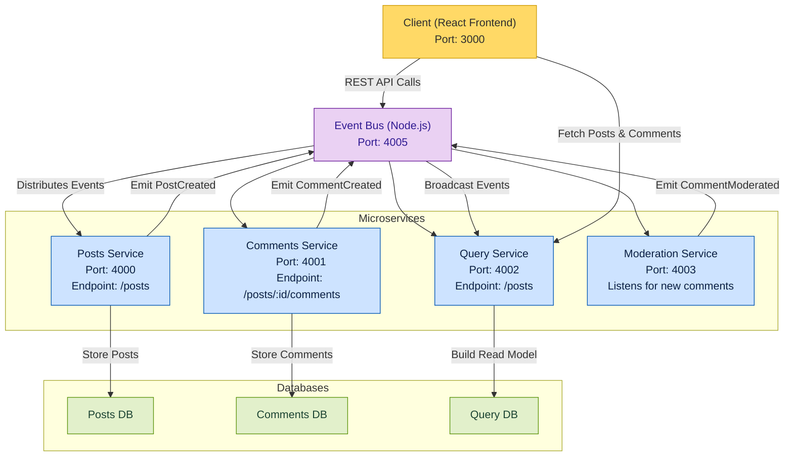

# 📰 Microservices Blog Platform

This project is a **microservices-based blog application** built using Node.js and React, containerized with Docker, and orchestrated using Docker Compose.

### The app allows users to:
- Create posts
- Comment on posts
- View posts with their comments
- Automatically moderate comments before displaying them

### 🧠 Notes:
- Each microservice is stateless and has its own internal data store (in-memory).
- Communication between services is event-driven via the event-bus.
- The moderation service ensures inappropriate content is filtered before appearing.
- The query service serves as the read model, optimized for frontend performance.
- The system is easily extendable — you can add services like authentication, analytics, or notifications.

> ⚠️ **Annotations:** The original source code of the microservices was not developed by me.  
> However, I have **modified, optimized, and fixed several parts** to ensure smooth integration, flexible containerization, and consistent operation across services.

---

## ⚙️ Architecture Overview

Each service runs independently in its own container and communicates asynchronously via an internal **Event Bus**.




### 🧩 Service Structure

| Service | Folder | Port | Description |
|----------|---------|------|--------------|
| **client** | `./client` | 3000 | React frontend web app |
| **posts** | `./posts` | 4000 | Handles post creation and emits events when a post is created |
| **comments** | `./comments` | 4001 | Manages comments for each post and emits events for new comments |
| **query** | `./query` | 4002 | Aggregates posts and comments for frontend queries |
| **moderation** | `./moderation` | 4003 | Moderates comments (e.g., filters bad words) before approval |
| **event-bus** | `./event-bus` | 4005 | Publishes and distributes events between all microservices |

---

## 🔄 Communication Flow

1. The **client** (frontend) creates a post → sends request to **posts service**.
2. The **posts service** emits a `PostCreated` event → sent to the **event-bus**.
3. The **event-bus** broadcasts this event to the **query** and other subscribed services.
4. When a user adds a comment:
   - The **comments service** emits a `CommentCreated` event → sent to the **event-bus**.
   - The **moderation service** listens for that event, checks for inappropriate words, and emits either `CommentApproved` or `CommentRejected`.
5. The **query service** listens for all these events and keeps an up-to-date data store for the frontend to query.
6. The **client** fetches all posts and their approved comments from the **query service**.

---

## 🐳 Docker Compose Setup

### 🧠 Prerequisites

Ensure you have:
- [Docker](https://www.docker.com/)
- [Docker Compose](https://docs.docker.com/compose/)

### ▶️ Build and Run All Services

From the `app-services/` directory, run:

```bash
docker compose up --build
```

### 🌐 Accessing the Application
When all containers are running:
- Open your browser and navigate to → http://localhost:3000
  
---

## 🧪 Testing Each Service Individually
You can test the backend services using `curl`

### 📝 Posts Service
Create a new post:
```bash
curl -X POST http://localhost:4000/posts \
     -H "Content-Type: application/json" \
     -d '{"title": "My first post"}'
```

### 💬 Comments Service
Add a comment to an existing post:
```bash
curl -X POST http://localhost:4001/posts/<POST_ID>/comments \
     -H "Content-Type: application/json" \
     -d '{"content": "Nice post!"}'
```
`<POST_ID>` use any post ID..

### 🔍 Query Service
Get all posts and comments:
```bash
curl http://localhost:4002/posts
```

### 🔄 Event-bus Service
Get all Events:
```bash
curl http://localhost:4005/events
```
---

## 🧰 Clean Up

Stop all services:
```bash
docker compose down
```
